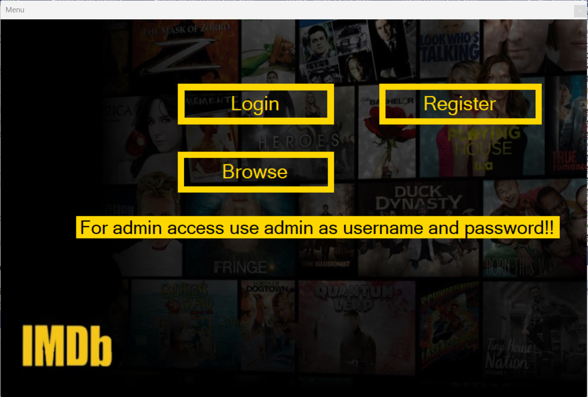
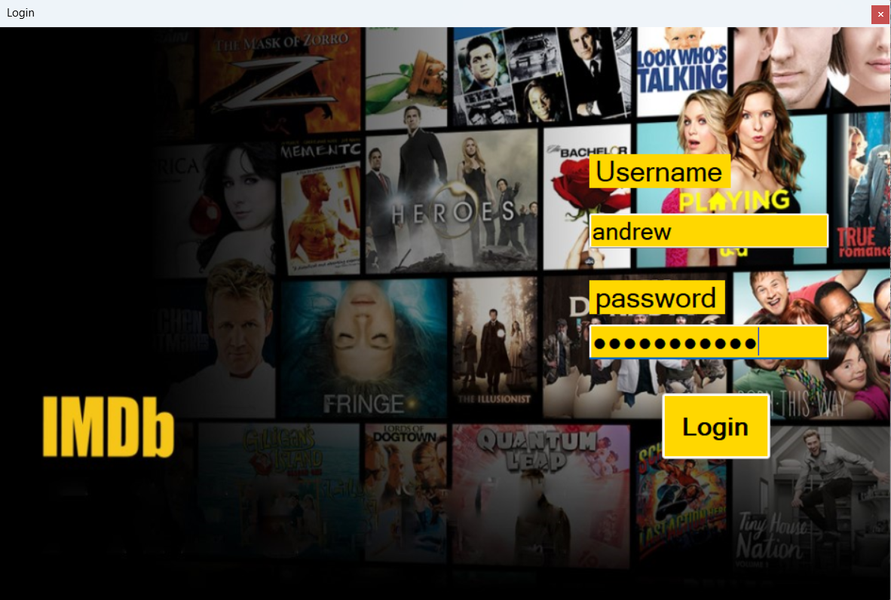
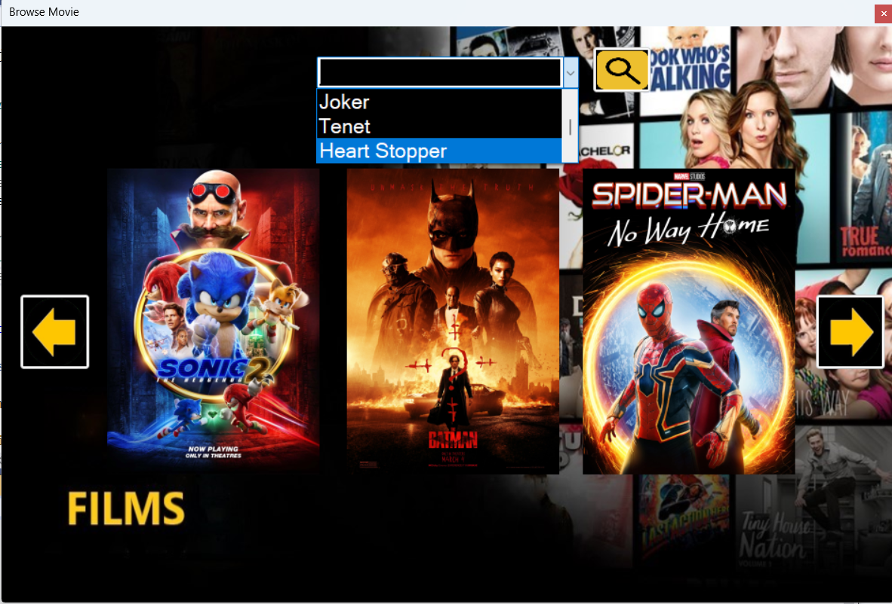
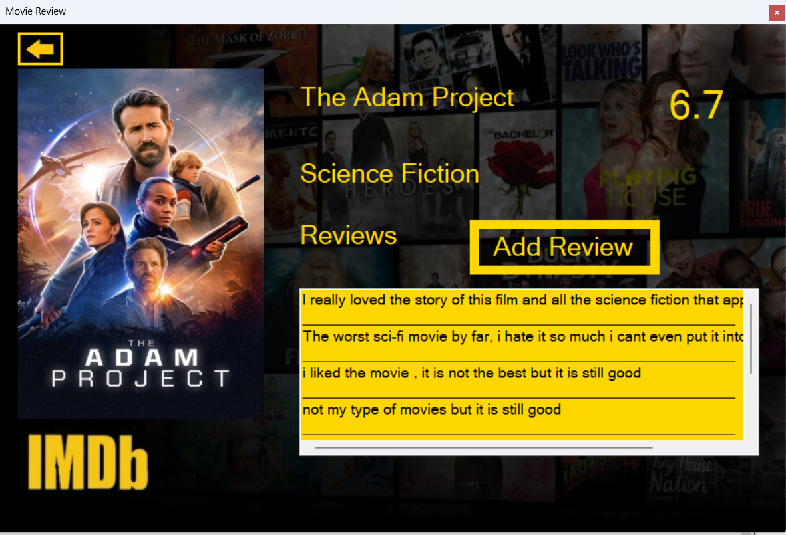
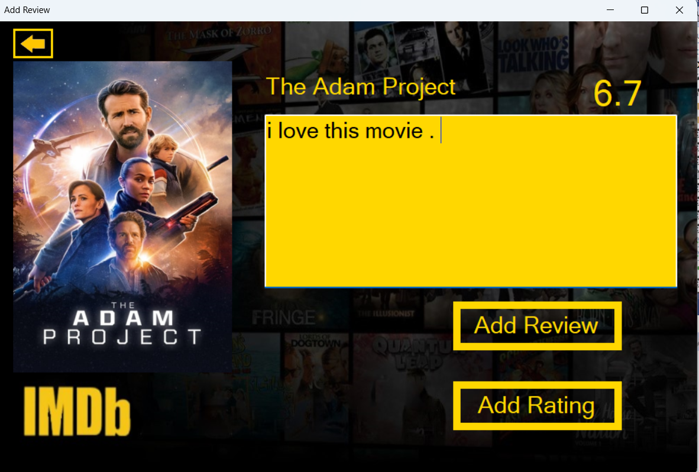
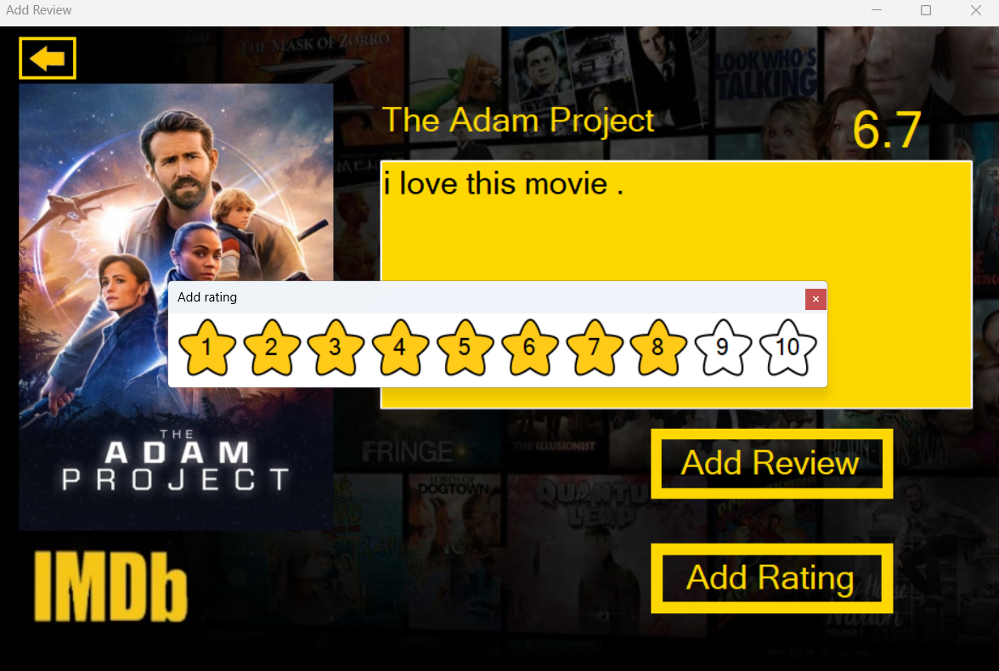
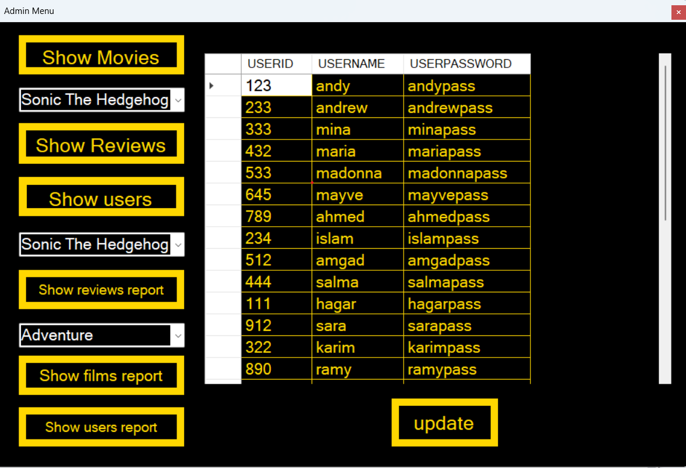
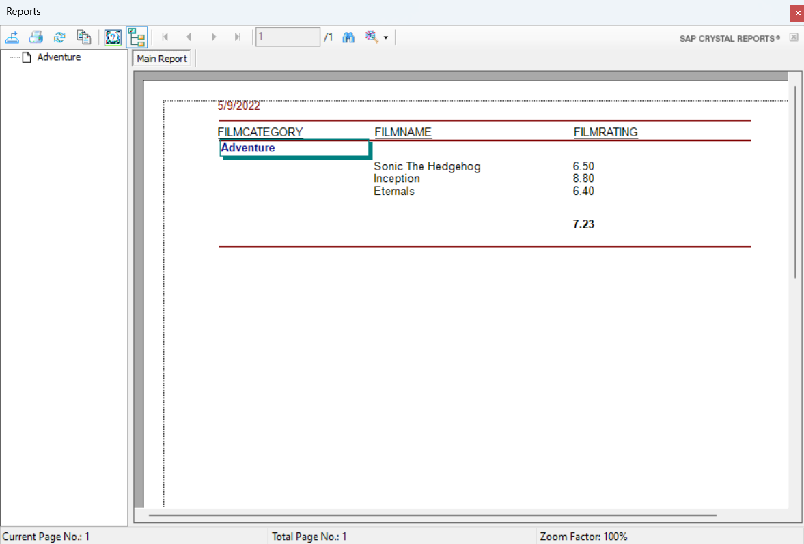
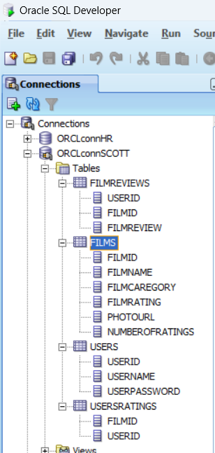

# IMDB-2022
IMDB is similiar to the real IMDB website where you can add rating and review for movies and browse all movies and other features 

There is word file name (IMDB scripts and stored procedures) , this word file contains the script and procedures that should be written in oracle database server (create sql connection with :data source = orcl; user id =scott; password=tiger)

